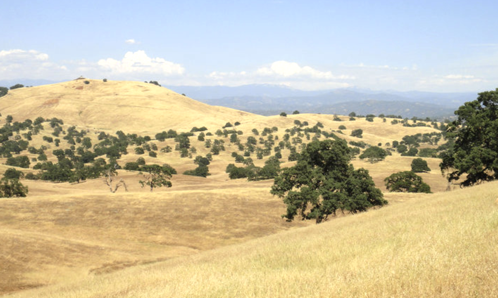

# Habitat Suitability: *Quercus douglasii*

#### Introduction

The blue oak (*Quercus douglasii*) is a deciduous [drought-tolerant](https://calscape.org/Quercus-douglasii-(Blue-Oak)) tree endemic to California. Blue oaks can be identified by their [blue-green foliage](https://oaks.cnr.berkeley.edu/oak-tree-species-id-ecology/), slightly to deeply lobed leaves, textured and pale gray bark, typical height between 20-60 ft., and natural settings of dry, rocky, and somewhat acidic to neutral soils. Acorns germinate in fall, appear in winter, and are propagated by species like the California Scrub-Jay which can [plant up to 3,300 oaks each year](https://www.allaboutbirds.org/guide/California_Scrub-Jay/lifehistory) (Tallamy, 2021). Most [seasonal development](https://www.fs.usda.gov/database/feis/plants/tree/quedou/all.html#114) occurs during March through May when water uptake is high and air temperatures rise. 

Across North America, oaks support more life than any other tree due to their caterpillar abundance. Caterpillars are necessary to sustain terrestrial food webs: they are a key survival food for baby birds and also support larger animals like bears. Within California, oak woodlands have one of the highest levels of biodiversity in the state, [sustaining over 5,000 plant and animal species](https://www.sacvalleycnps.org/oak-woodland/#:~:text=Habitat%20Values,and%20streams%20for%20anadromous%20fishes). The blue oak alone is estimated to [host approximately 170 moth and butterfly species](https://calscape.org/plant/Quercus-douglasii-(Blue-Oak)/host). This species can be found among [plant communities](https://calscape.org/Quercus-douglasii-(Blue-Oak)) such as chaparral, foothill woodland, and oak woodland at elevations of 500-2000 ft. in the north and up to 5000 ft. in the south. The blue oak is dispersed throughout the state including in the central Sierra Nevada Eldorado National Forest and the central Coast and Transverse Ranges in Los Padres National Forest.

#### Data Description

[National Forest System Land Units](https://data.fs.usda.gov/geodata/edw/datasets.php?xmlKeyword=forest) includes proclaimed national forest, purchase unit, national grassland, land utilization project, research and experimental area, national preserve, and other land area. An NFS Land Unit is nationally significant classification of Federally owned forest, range, and related lands that are administered by the USDA Forest Service or designated for administration through the Forest Service. 

[MACAv2-METDATA](https://climate.northwestknowledge.net/MACA/index.php) is a downscaled climate dataset that covers CONUS at 4 kilometers (1/24 degree) resolution. Temporal coverage encompasses historical model output (1950-2005) and projections (2006-2099) for climate normals represented as monthly values. Climate variables are from the Canadian Centre for Climate Modeling and Analysis ([CanESM2](https://nccasc.colorado.edu/project/canesm2-downscaled-climate-projections-800m-spatial-resolution-north-central-united-states)) model with simulations from two emissions scenarios (RCP 4.5 and 8.5). 

Probabilistic Remapping of SSURGO ([POLARIS](https://www.usgs.gov/publications/polaris-properties-30-meter-probabilistic-maps-soil-properties-over-contiguous-united)) soil properties is a dataset of 30‐m probabilistic soil property maps over the contiguous United States (CONUS). The mapped variables over CONUS include soil texture, organic matter, pH, saturated hydraulic conductivity, Brooks‐Corey and Van Genuchten water retention curve parameters, bulk density, and saturated water content.

The [SRTM 1 Arc-Second Global](https://doi.org/10.5066/F7PR7TFT) product offers global coverage of void filled elevation data at a resolution of 1 arc-second (30 meters). The Shuttle Radar Topography Mission (SRTM) was flown aboard the space shuttle Endeavour February 11-22, 2000.

#### Data Citation

Abatzoglou, J. T. & Brown, T. J. (2012). *MACAv2-METDATA* [Data set]. http://thredds.northwestknowledge.net:8080/thredds/reacch_climate_CMIP5_macav2_catalog2.html

Chaney, N. W., Minasny, B., Herman, J. D., Nauman, T. W., Brungard, C. W., Morgan, C. L. S., McBratney, A. B., Wood, E. F., & Yimam, Y. (2019, February 5). POLARIS soil properties: 30-m probabilistic maps of soil properties over the contiguous United States. *Water Resources Research, 55*(4). https://doi.org/10.1029/2018WR022797

NASA. (2024). *SRTM 1 Arc-Second Global* [Data set]. https://doi.org/10.5066/F7PR7TFT

USDA Forest Service. (2024). *National Forest System Land Units* [Data set]. https://data.fs.usda.gov/geodata/edw/edw_resources/shp/S_USA.NFSLandUnit.zip

#### Methods

The land units [shapefile](https://data.fs.usda.gov/geodata/edw/edw_resources/shp/S_USA.NFSLandUnit.zip) was extracted and read into a GeoDataFrame with geopandas and subset for site locations. [earthaccess](https://earthaccess.readthedocs.io/en/latest/) (a library for NASA's Search API) retrieved digital elevation models by dataset ([SRTMGL1](https://doi.org/10.5066/F7PR7TFT)) which were scoped to spatial bounds collected from the unit sites. Mean soil data was selected for pH, depth, and location through [POLARIS](https://www.usgs.gov/publications/polaris-properties-30-meter-probabilistic-maps-soil-properties-over-contiguous-united). 

Data granules were processed into soil and elevation rasters through masking, scaling, cropping, and merging. The [xarray-spatial](https://docs.xarray.dev/en/stable/index.html) aspect function calculated aspect in degrees for each cell in a site elevation raster. Projected climate scenarios (medium and high emissions) for a monthly average of daily maximum near-surface air temperature in 2096-2099 were obtained from [MACAV2]((https://climate.northwestknowledge.net/MACA/index.php)), scoped to site boundaries, assigned a longitude coordinate range aligned with existing rasters, and converted from Kelvin to Fahrenheit. Sites and corresponding attributes were subsequently plotted using the [hvplot API](https://hvplot.holoviz.org/) and exported to rasters.

Given optimal characteristics for each site variable, a habitat suitability score may be identified leveraging a fuzzy Gaussian function to assign scores for each raster cell based on proximity to ideal site values. For each site and climate scenario, variable rasters can be harmonized across resolution and projection, suitability layers calculated and multiplied, subset for a suitable threshold with [xarray](https://docs.xarray.dev/en/stable/index.html), and combined into a final raster. 

#### Discussion

Under both medium and high emissions scenarios, the average annual maximum temperatures are [projected to grow by 7.5°F to 10.9°F](https://www.fs.usda.gov/Internet/FSE_DOCUMENTS/fseprd985002.pdf) at the end of the century (see RCP 4.5 vs. 8.5 Average Max Temperature plots). Intense precipitation events are projected as well, with the frequencies of [pronounced dry seasons and whiplash events](https://doi.org/10.1038/s41558-018-0140-y) expanding by over 50% across the state with a notable change in Southern California: a ~200% increase in extreme dry seasons, a ~150% increase in extreme wet seasons, and a ~75% increase in year-to-year whiplash. Blue oaks are equipped to tolerate drier conditions than other native trees, dominating areas with less precipitation and conducive soils where they often cohabitate with foothill pine. However, given a severe drought the threshold of [site tolerance](https://oaks.cnr.berkeley.edu/wp-content/uploads/2020/04/Swiecki-Bernhardt-Oak-Mortality-4.2-2020.pdf ) becomes diminished. Additionally, although blue oaks have evolved in an environment where fires occur regularly and can survive low-to-moderate intensity fires, the threat of conifer encroachment subjects oaks to increased canopy fire risk. 

Los Padres National Forest is [vulnerable to the floods](https://www.fs.usda.gov/Internet/FSE_DOCUMENTS/fseprd497638.pdf) and debris flows after extreme precipitation events, in particular after recurrent wildfires, due to the forest’s position of the Coast and Transverse mountain ranges in relation to the coast. Sediment flow in Southern California has a history of high variability under El Nino/Southern Oscillation (ENSO) events and has led to the destruction of oak riparian habitats. Future neutral scenarios predict higher nighttime minimum temperatures and consequently an expansion of mixed woodland with oaks replacing conifer-domainated areas. Similarly, Eldorado National Forest is projected to experience extreme climate variability between wet and dry years. Toward the end of the century at the lowest and highest elevations in the Sierra Nevada, warming temperatures will lead to greater evaporation and a projected ~15% reduction in fuel and soil moisture. This scenario indicates greater drought likelihood and impacts across native plant communities. Heighted fire weather conditions will produce [shifts in blue oak mortality rates](https://www.fs.usda.gov/Internet/FSE_DOCUMENTS/fseprd985002.pdf ) as well as post-fire germination. Moreover a shift in oak mortality affects fire activity. Blue oak sites with [south-facing aspects](https://esajournals.onlinelibrary.wiley.com/doi/full/10.1002/ecs2.3558) in particular demonstrate lower potential for accumulated drainage and the highest level of mortality compared to other sites. These areas are especially at risk for greater dead woody surface fuels, enhancing the probability of larger fires over longer periods. 

#### References

Barrett, A., Battisto, C., J. Bourbeau, J., Fisher, M., Kaufman, D., Kennedy, J., … Steiker, A. (2024). *earthaccess* (Version 0.12.0) [Computer software]. Zenodo. https://doi.org/10.5281/zenodo.8365009

California Native Plant Society (CNPS). (n.d.). Blue oak. https://calscape.org/Quercus-douglasii-(Blue-Oak)

Collins, B., Hetzel, J. T., & Metzger, T. C. (2024). *xarray-spatial* (Version 0.4.0) [Computer software]. GitHub. https://github.com/makepath/xarray-spatial/releases/tag/v0.4.0

Estes, B. & Gross, S. (2020). *Eldorado National Forest climate change trend summary.* USDA Forest Service. https://www.fs.usda.gov/Internet/FSE_DOCUMENTS/fseprd985002.pdf

Huesca, M., Ustin, S. L., Shapiro, K. D., Boynton, R., & Thorne, J. H. (2021, June 16). Detection of drought-induced blue oak mortality in the Sierra Nevada Mountains, California. Ecosphere, 12(6). https://doi.org/10.1002/ecs2.3558

Hunter, J. D. (2024). *Matplotlib: A 2D graphics environment* (Version 3.9.2) [Computer software]. Zenodo. https://zenodo.org/records/13308876

Jordahl, K., Van den Bossche, J., Fleischmann, M., Wasserman, J., McBride, J., Gerard, J., … Leblanc, F. (2024). *geopandas/geopandas: v1.0.1* (Version 1.0.1) [Computer software]. Zenodo. https://doi.org/10.5281/zenodo.12625316 

Molinari, N., Sawyer, S., & Safford, H. (n.d.). *A summary of current trends and probable future trends in climate and climate-driven processes in the Los Padres National Forest and neighboring lands.* USDA Forest Service. https://www.fs.usda.gov/Internet/FSE_DOCUMENTS/fseprd497638.pdf

Point Blue Conservation Science. (n.d.). *California oak planting guide.* https://www.pointblue.org/wp-content/uploads/2023/06/Planting-Oaks-Guide-Version-1.pdf

Python Software Foundation. (2024). *Python* (Version 3.12.6) [Computer software]. https://docs.python.org/release/3.12.6 

Rudiger, P., Liquet, M., Signell, J., Hansen, S. H., Bednar, J. A., Madsen, M. S., … Hilton, T. W. (2024). *holoviz/hvplot: Version 0.11.0* (Version 0.11.0) [Computer software]. Zenodo. https://doi.org/10.5281/zenodo.13851295 

Sacramento Valley Chapter (CNPS). (n.d.). *Oak woodland.* https://www.sacvalleycnps.org/oak-woodland/#:~:text=Habitat%20Values,and%20streams%20for%20anadromous%20fishes

Snow, A. D., Scott, R., Raspaud, M., Brochart, D., Kouzoubov, K., Henderson, S., … Weidenholzer, L. (2024). *corteva/rioxarray: 0.18.1 Release* (Version 0.18.1) [Computer software]. Zenodo. https://doi.org/10.5281/zenodo.

Swain, D. L., Langenbrunner, B., Neelin, J. D., & Hall, A. (2018). Increasing precipitation volatility in twenty-first-century California. *Nature Climate Change, 8*(5), 427. https://doi.org/10.1038/s41558-018-0140-y

Swiecki, T. & Bernhardt, E. (2020). *Recent increases in blue oak mortality.* Phytosphere Research. https://oaks.cnr.berkeley.edu/wp-content/uploads/2020/04/Swiecki-Bernhardt-Oak-Mortality-4.2-2020.pdf

Tallamy, D. W. (2021). *The nature of oaks: The rich ecology of our most essential native trees.* Timber Press.

The pandas development team. (2024). *pandas-dev/pandas: Pandas* (Version 2.2.2) [Computer software]. Zenodo. https://doi.org/10.5281/zenodo.3509134

UC Oaks. (n.d.). *Blue oak-foothill pine woodland & wildlife habitat*. https://oaks.cnr.berkeley.edu/blue-oak-foothill-pine-woodland-wildlife-habitat

UC Oaks. (n.d.). *Coastal oak woodland & wildlife habitat.* https://oaks.cnr.berkeley.edu/coastal-oak-woodland/

UC Oaks. (2024, July 1). *Oak tree species ID & ecology.* https://oaks.cnr.berkeley.edu/oak-tree-species-id-ecology

USDA Forest Service. (n.d.). *About the area*. https://www.fs.usda.gov/main/eldorado/about-forest/about-area

USDA Forest Service. (n.d.). *About the forest*. https://www.fs.usda.gov/main/lpnf/about-forest

USDA Forest Service. (n.d.). *Quercus douglasii*. https://www.fs.usda.gov/database/feis/plants/tree/quedou/all.html

USDA Southern Research Station. (n.d.). *Quercus douglasii*. https://www.srs.fs.usda.gov/pubs/misc/ag_654/volume_2/quercus/douglasii.htm#:~:text=Annual%20precipitation%20averages%20510%20to,the%20annual%20fall%20of%20moisture

Run locally
----

### Download/Clone Git Repository

    $cd <replace with desired location of project folder>
    $git clone https://github.com/lauren-alexandra/habitat-suitability.git
    $cd habitat-suitability

### Create Environment

    $conda create -n myenv
    $conda activate myenv

### Install required packages

    $conda install pip
    $pip install -r requirements.txt

### Set up Jupyter Notebook Kernel

    $pip install --user ipykernel
    $python -m ipykernel install --user --name=myenv

### Launch Jupyter Notebook

    (in git bash or other conda environment)
    $jupyter notebook

